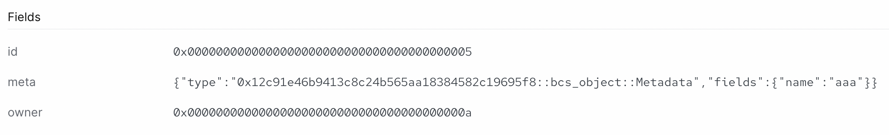

# BCS 编码

Binary Canonical Serialization, [BCS](https://github.com/diem/bcs), 是在 Diem 区块链项目中开发出来的序列化格式，现在也被广泛应用于大部分基于 Move 的区块链，比如Sui, Starcoin, Aptos, 0L. 除了在 Move VM 虚拟机中使用，BCS也被用在交易 transaction 和事件 event 编码中，比如在签署交易之前做序列化处理，解析事件数据。

如果你想深入了解Move的工作原理并成为Move专家，了解BCS的工作原理是至关重要的。让我们开启深入探讨。

## BCS 特性说明

在我们继续学习的过程中，有一些关于BCS编码的高级属性是值得记住的:

- BCS是一种数据序列化格式，其生成的输出字节不包含任何类型信息。因此，接收编码字节的一方需要知道如何反序列化数据
- BCS 中没有数据类型，当然也没有结构体 structs; struct 只是定义了内部字段 fields 被序列化的顺序
- Wrapper 类型会被忽略掉，因此 `OuterType` 和 `UnnestedType` 会有同样的BCS表示:

    ```rust
    public struct OuterType {
        owner: InnerType
    }
    public struct InnerType {
        address: address
    }
    public struct UnnestedType {
        address: address
    }
    ```
- 包含泛型类型字段的类型可以被解析到第一个泛型类型字段。因此，如果泛型类型字段是自定义类型，并且需要进行序列化和反序列化操作，将泛型类型字段放在最后是一个好的实践方式。
    ```rust
    public struct BCSObject<T> has drop, copy {
        id: ID,
        owner: address,
        meta: Metadata,
        generic: T
    }
    ```
    在这个例子中，我们可以将所有数据反序列化直到`meta`字段。
- 原始类型 primitive types（如无符号整数）以小端格式进行编码
- 不定长向量 Vector 被序列化成一个表明包含向量 vector 长度的数字(最大取值是 `u32`), 后面跟着向量内的元素。[参考样例](https://github.com/diem/bcs#fixed-and-variable-length-sequences)都是采用[小端编码](https://en.wikipedia.org/wiki/LEB128)。

完整的BCS特性说明可以在 [BCS repository](https://github.com/diem/bcs) 里找到。

## 使用 `@mysten/bcs` NPM 库

### 运行

查看库文档[@mysten/bcs library](https://www.npmjs.com/package/@mysten/bcs). 运行环境是[deno](https://deno.land/), 无手动安装操作，直接导入即可。

```Typescript
import { BCS, getSuiMoveConfig } from "npm:@mysten/bcs";
```

### 基础用例

使用bcs库对一些简单数据做序列化和反序列化操作:

```typescript
import { BCS, getSuiMoveConfig } from "npm:@mysten/bcs";

// initialize the serializer with default Sui Move configurations
const bcs = new BCS(getSuiMoveConfig());

// Define some test data types
const integer = 10;
const array = [1, 2, 3, 4];
const string = "test string"

// use bcs.ser() to serialize data
const ser_integer = bcs.ser(BCS.U16, integer);
const ser_array = bcs.ser("vector<u8>", array);
const ser_string = bcs.ser(BCS.STRING, string);

// use bcs.de() to deserialize data
const de_integer = bcs.de(BCS.U16, ser_integer.toBytes());
const de_array = bcs.de("vector<u8>", ser_array.toBytes());
const de_string = bcs.de(BCS.STRING, ser_string.toBytes());

```

我们可以像上面的语法那样，用内置的默认设置`new BCS(getSuiMoveConfig())`来初始化Sui Move的序列化器实例。

BCS中有内置的枚举类型，如`BCS.U16`, `BCS.STRING`等，可以直接被当作 Sui Move 类型使用。对于[泛型类型](../../../unit-three/lessons/2_intro_to_generics.md)，可以使用与Sui Move相同的语法进行定义，例如上面的示例中的`vector<u8>`。

现在来仔细观察序列化和反序列化字段:

```bash
# ints are little endian hexadecimals
0a00
10
# the first element of a vector indicates the total length,
# then it's just whatever elements are in the vector
0401020304
1,2,3,4
# strings are just vectors of u8's, with the first element equal to the length of the string
0b7465737420737472696e67
test string
```

### 类型注册

可以使用以下语法，来注册我们将要使用的自定义类型:

```javascript
import { BCS, getSuiMoveConfig } from "npm:@mysten/bcs";
const bcs = new BCS(getSuiMoveConfig());

// Register the Metadata Type
bcs.registerStructType("Metadata", {
  name: BCS.STRING,
});

// Same for the main object that we intend to read
bcs.registerStructType("BCSObject", {
  // BCS.ADDRESS is used for ID types as well as address types
  id: BCS.ADDRESS,
  owner: BCS.ADDRESS,
  meta: "Metadata",
});
```

## 在 Sui 智能合约中使用 `bcs`

继续使用上面 structs 的例子来进行演示。

### 定义 Struct

我们首先在 Sui Move 合约中定义与之前对应的 struct.

```rust
{
    //..
    struct Metadata has drop, copy {
        name: std::ascii::String
    }

    struct BCSObject has drop, copy {
        id: ID,
        owner: address,
        meta: Metadata
    }
    //..
}
```

### 反序列化

现在，在 Sui 合约中写一个函数将一个 object 反序列化操作。

```rust
public fun object_from_bytes(bcs_bytes: vector<u8>): BCSObject {

    // Initializes the bcs bytes instance
    let bcs = bcs::new(bcs_bytes);

    // Use `peel_*` functions to peel values from the serialized bytes. 
    // Order has to be the same as we used in serialization!
    let (id, owner, meta) = (
    bcs::peel_address(&mut bcs), bcs::peel_address(&mut bcs), bcs::peel_vec_u8(&mut bcs)
    );
    // Pack a BCSObject struct with the results of serialization
    BCSObject { id: object::id_from_address(id), owner, meta: Metadata {name: std::ascii::string(meta)}  } }
```

在 Sui [`bcs` 模块](https://github.com/MystenLabs/sui/blob/main/crates/sui-framework/docs/bcs.md)中，各种`peel_*`方法用于从BCS序列化的字节中"peel"出每个单独的字段。请注意，我们"peel"字段的顺序必须与结构定义中字段的顺序完全相同。

_测验: 为什么在对同一个`bcs`对象调用的前两个`peel_address`的结果不相同?_

还要注意我们如何使用辅助函数将类型从`address`转换为`id`，以及从`vector<8>`转换为`std::ascii::string`.

_测验: 如果`BSCObject`拥有的类型是`UID`而不是`ID`，会发生什么?_

## 补全 序列化/反序列化 示例

完整的 TypeScript 和 Sui Move 示例代码可以在[`example_projects`](../example_projects/)文件夹中找到。

首先，我们使用TypeScript程序序列化一个测试object:

```javascript
// We construct a test object to serialize, note that we can specify the format of the output to hex
let _bytes = bcs
  .ser("BCSObject", {
    id: "0x0000000000000000000000000000000000000000000000000000000000000005",
    owner: "0x000000000000000000000000000000000000000000000000000000000000000a",
    meta: {name: "aaa"}
  })
  .toString("hex");
```

这次我们希望BCS writer的输出是十六进制格式，可以像上面那样指定。

将序列化结果的十六进制字符串添加前缀 `0x`, 并导出到一个环境变量中:

```bash
export OBJECT_HEXSTRING=0x0000000000000000000000000000000000000000000000000000000000000005000000000000000000000000000000000000000000000000000000000000000a03616161
```

现在我们可以运行相关的Move单元测试来检查正确性:

```bash 
sui move test
```

你应该会在控制台中看到这个:

```bash
BUILDING bcs_move
Running Move unit tests
[ PASS    ] 0x0::bcs_object::test_deserialization
Test result: OK. Total tests: 1; passed: 1; failed: 0
```

或者我们可以发布该模块(并导出PACKAGE_ID), 然后使用上述BCS序列化的十六进制字符串调用 `emit_object` 方法:

```bash
sui client call --function emit_object --module bcs_object --package $PACKAGE_ID --args $OBJECT_HEXSTRING --gas-budget 100000000
```

我们可以检查Sui Explorer上交易事务的 `Events` 选项卡，以查看emit输出的反序列化`BCSObject`是否正确:


