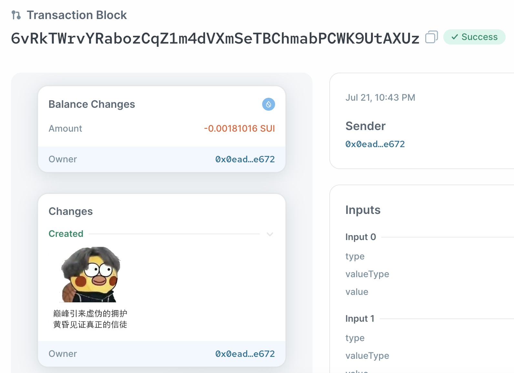

# 签署交易

导入账户之后，可以参考 [TypeScript SDK 文档](https://github.com/MystenLabs/sui/tree/main/sdk/typescript) 使用该账户执行各种交易。
目前，传入不同数据格式参数时还缺乏具体官方文档指导，可以参考一些Github Repo的实现。比如[案例一](https://github.com/icodezjb/learn-move/blob/main/sui-vector/call.ts)······(待补充)。

## 发起交易

完成一个简单的合约调用，可以预先[给TestNet的账户申请sui-token](../../../unit-one/lessons/1_配置环境.md#获得测试网-testnet-的-sui-tokens)用于支付gas. 

初始化设置RPCProvider, packageObjectId, RawSigner.
```typescript
// connect to TestNet
const provider = new JsonRpcProvider(testnetConnection);
const packageObjectId = '0x277ffe8d7c082864aeaa0439fd7129ce3e604dab223674de29449792296d2163';
const signer = new RawSigner(keypair, provider);
```

执行调用合约public函数逻辑。

```typescript
const tx = new TransactionBlock();
// public entry fun mint(
//     name: vector<u8>
//     image_url: vector<u8>
//     recipient: Option<address> tx.pure([]) | tx.pure(['0x...'])
// )
tx.moveCall({
    target: `${packageObjectId}::nft::mint`,
    arguments: [tx.pure('ikunidol.com'), tx.pure('https://pdan.cdn.dfyun.com.cn/pdan1/2023/0629/7.jpg'), tx.pure([address])],
});
const result = await signer.signAndExecuteTransactionBlock({
    transactionBlock: tx,
});
console.log({ result });
```

完整的代码可以在[这里](../example_projects/secp256k1_callfun.ts)找到。

执行程序`secp256k1_callfun.ts`

`deno run secp256k1_callfun.ts`

打印执行结果
```json
{
  result: {
    digest: "6vRkTWrvYRabozCqZ1m4dVXmSeTBChmabPCWK9UtAXUz",
    confirmedLocalExecution: false
  }
}
```

其中`digest`是交易打包的编码，将其复制到[suiexplorer](https://suiexplorer.com/txblock/6vRkTWrvYRabozCqZ1m4dVXmSeTBChmabPCWK9UtAXUz?network=testnet)上查询，可以看到交易信息。



### 小练习

参考 [TypeScript SDK 文档](https://github.com/MystenLabs/sui/tree/main/sdk/typescript) 使用脚本导入账号完成更多交易功能，比如分割、合并Coin, 发送object等。


## signData解析