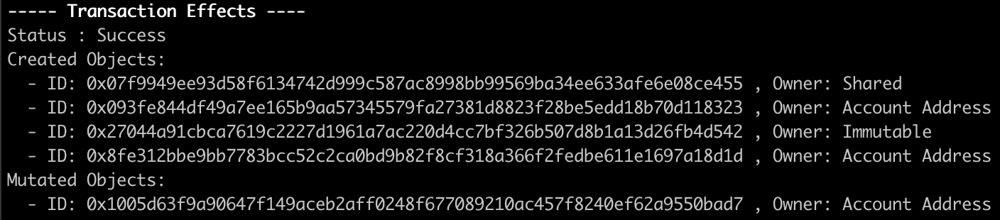

# 数据迁移

智能合约升级还涉及到数据迁移，将旧版合约中的数据移动到新版合约中来。如果没有数据迁移，另外重新发布一个合约也行。

## 共享的 Object 

记录的数据通常会以共享的 object 存放，合约升级之后，新版和旧版的合约其实都还可以对该共享的 object 进行操作。  
有的时候会因为函数不兼容或给共享 object 添加了动态属性导致不兼容造成出错。可以考虑给共享 object 添加版本属性，限制只允许新版的合约进行操作，打破共享 object 的往后兼容，强迫用户选择升级。

## 计数器合约升级

以一个计数器的案例来演示如何进行合约升级。

### 实现目标

原始合约是使用了共享 object 来累加计数

```Rust
public entry fun increment(c: &mut Counter) {
    c.value = c.value + 1;
}
```

升级后的合约添加了每累加 100 就发出 event 信息的功能

```Rust
struct Progress has copy, drop {
    reached: u64
}

public entry fun increment(c: &mut Counter) {
    c.value = c.value + 1;

    if (c.value % 100 == 0) {
        event::emit(Progress { reached: c.value });
    }
}
```

只实现了原本计数功能的合约可以在这里找到[完整代码](../example_projects/counter/sources/counter_1.move_wip)。

### 修改合约以支持升级

对原本计数功能的合约进行修改，以支持后续合约升级中的数据迁移。

1. 在合约当前 module 中使用常量 `VERSION` 记录当前的版本信息.

```Rust
    const VERSION: u64 = 1;
```

2. 在共享 object `Counter` 中添加新的 `version` 属性来记录当前共享 object 的版本信息。

```Rust
    struct Counter has key {
        id: UID,
        // 2. Track the current version of the shared object
        version: u64,
        // 3. Associate the `Counter` with its `AdminCap`
        admin: ID,
        value: u64,
    }
```

3. 让执行共享 object 版本升级数据迁移的操作成为专有操作，并只允许使用 `AdminCap` 来调用。

```Rust
    /// Not the right admin for this counter
    const ENotAdmin: u64 = 0;

    fun init(ctx: &mut TxContext) {
        let admin = AdminCap {
            id: object::new(ctx),
        };

        transfer::share_object(Counter {
            id: object::new(ctx),
            version: VERSION,
            admin: object::id(&admin),
            value: 0,
        });

        transfer::transfer(admin, tx_context::sender(ctx));
    }
```

4. 确保所有调用了共享 object 的 entry 函数都会检查，确保共享 object 的版本属性 `version` 与合约版本 `VERSION` 一致。

```Rust
    /// Calling functions from the wrong package version
    const EWrongVersion: u64 = 1;

    public entry fun increment(c: &mut Counter) {
        // 4. Guard the entry of all functions that access the shared object with a version check.
        assert!(c.version == VERSION, EWrongVersion);
        c.value = c.value + 1;
    }
```

修改到可以支持升级的合约可以在这里找到[完整代码](../example_projects/counter/sources/counter_2.move_wip)。

这时候 package 配置文件 `Move.toml` 的格式是这样的

```bash
[package]
name = "sui_package"
version = "0.0.0"

[addresses]
sui_package = "0x0"
```

使用 Sui CLI 发布合约

```
sui client publish --gas-budget <GAS-BUDGET-AMOUNT>
```

并且记录下发布后的地址信息



`Immutable` 是合约发布地址，`Shared` 是该合约中共享的 object.
使用 [suiexplorer](https://suiexplorer.com/) 或者 
```
sui client object <OBJECT-ID>
```
判别区分出`AdminCap`和`UpgradeCap`. 其中`AdminCap`在后续共享object数据迁移中用来管理权限，`UpgradeCap`是合约升级的关键权限，在[下一节定制升级权限](./3_%E5%AE%9A%E5%88%B6%E5%8D%87%E7%BA%A7%E6%9D%83%E9%99%90.md)做更详细讲解。

### 升级后的合约

升级后的合约除了功能更新之外，还需要做以下额外修改。
1. 增大 package 的`VERSION`.

```Rust
    // 1. Bump the `VERSION` of the package.
    const VERSION: u64 = 2;
```

2. 引入 `migrate` 函数来升级共享 object.

```Rust
    // 2. Introduce a migrate function
    entry fun migrate(c: &mut Counter, a: &AdminCap) {
        assert!(c.admin == object::id(a), ENotAdmin);
        assert!(c.version < VERSION, ENotUpgrade);
        c.version = VERSION;
    }
```
需要注意的是，`migrate` 函数是非public的entry函数，这让 `migrate` 函数可以被 Sui CLI 或 SDK 调用，但无法被其他 module 调用。这种权限允许了将来升级的合约可以自由修改输入的参数格式。还做了 `AdminCap` 权限管理的检查以及确保合约先升级再进行共享object升级的检查。

在合约升级之后，共享的 object 并不会自动升级，还需要调用 `migrate` 函数升级。

其他功能更新

```Rust
    struct Progress has copy, drop {
        reached: u64,
    }

    /// Not the right admin for this counter
    const ENotAdmin: u64 = 0;

    /// Migration is not an upgrade
    const ENotUpgrade: u64 = 1;

    /// Calling functions from the wrong package version
    const EWrongVersion: u64 = 2;

    public entry fun increment(c: &mut Counter) {
        assert!(c.version == VERSION, EWrongVersion);
        c.value = c.value + 1;

        if (c.value % 100 == 0) {
            event::emit(Progress { reached: c.value })
        }
    }
```

升级后的合约可以在这里找到[完整代码](../example_projects/counter/sources/counter.move)。

对配置文件 `Move.toml` 进行编辑，`<ORIGINAL-PACKAGE-ID>` 填写之前发布合约的地址。

```bash
[package]
name = "sui_package"
version = "0.0.1"
published-at = "<ORIGINAL-PACKAGE-ID>"

[addresses]
sui_package = "0x0"
```

运行合约升级命令行，其中`<UPGRADE-CAP-ID>`处填写`UpgradeCap`的Object ID.
```bash
sui client upgrade --gas-budget <GAS-BUDGET-AMOUNT> --upgrade-capability <UPGRADE-CAP-ID>
```

运行结果如下，表明合约升级成功，其中出现的 `Immutable` 是升级后合约的发布地址。


