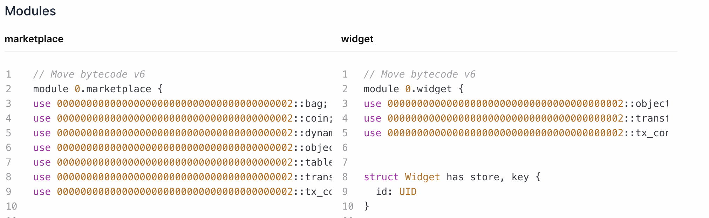
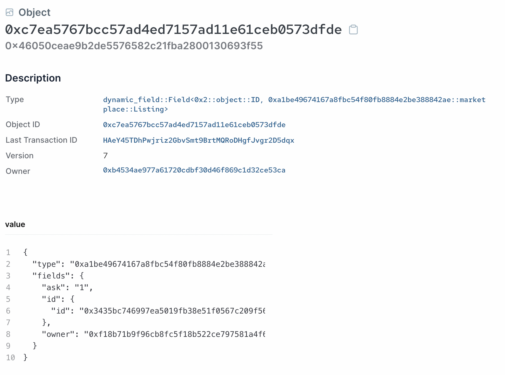

# 部署和测试

接下来我们可以通过 SUI CLI 部署和测试我们的市场合约。

我们创建了一个简单的 `marketplace::widget` 模块，这样我们就可以创建一些项目供我们列出以帮助测试。

```rust
module marketplace::widget {

    use sui::object::{Self, UID};
    use sui::transfer;
    use sui::tx_context::{Self, TxContext};

    struct Widget has key, store {
        id: UID,
    }

    public entry fun mint(ctx: &mut TxContext) {
        let object = Widget {
            id: object::new(ctx)
        };
        transfer::transfer(object, tx_context::sender(ctx));
    }
}
```

这基本上是第一单元的 Hello World 项目，但变得更加简单。

## 部署

首先我们发布两个包：

```bash
    sui client publish --gas-budget 3000
```

您应该会看到在资源管理器上发布的`marketplace`和`widget`模块：



将包对象 ID 导出到环境变量中：

```bash
export PACKAGE_ID=<package object ID from previous output>
```

## 初始化市场

接下来，我们需要通过调用`create`入口函数来初始化市场合约。 我们想向它传递一个类型参数，以指定该市场将接受哪种类型的可替代代币。 在这里使用 `Sui` 原生标记是最简单的。 我们可以使用以下 CLI 命令：

```bash
sui client call --function create --module marketplace --package $PACKAGE_ID --type-args 0x2::sui::SUI --gas-budget 1000
```

请注意为`SUI`令牌传递类型参数的语法。

将 Marketplace 共享对象的 ID 导出到环境变量中：

```bash
export MARKET_ID=<marketplace shared object ID from previous output>
```

## Listing

首先，我们制作一个要列出的`widget`项目：

```bash
sui client call --function mint --module widget --package  $PACKAGE_ID --gas-budget 1000
```

将生成的`widget`的对象项保存到环境变量中：

```bash
export ITEM_ID=<object ID of the widget item from console>
```

然后我们将这个项目列出到我们的市场：

```bash
sui client call --function list --module marketplace --package $PACKAGE_ID --args $MARKET_ID $ITEM_ID 1 --type-args $PACKAGE_ID::widget::Widget 0x2::sui::SUI --gas-budget 1000
```

我们需要在这里提交两个类型参数，第一个是要列出的项目的类型，第二个是用于支付的可替代硬币类型。 上面的例子使用了 `1` 的标价。

提交本次交易后，您可以在[Sui explorer](https://explorer.sui.io/)查看新建的listing：



## Purchase

拆分出一个金额为“1”的“SUI”币对象作为支付对象。 您可以使用 `sui client gas` CLI 命令查看您帐户下可用的 `SUI` 代币列表，然后选择一个进行拆分。

```bash
    sui client split-coin --coin-id <object ID of the coin to be split> --amounts 1 --gas-budget 1000
```

导出余额为“1”的新拆分的`SUI`币的对象ID：

```bash
    export PAYMENT_ID=<object ID of the split 1 balance SUI coin>
```

_测验：作为练习，修改市场合约以接受任何余额足以支付要价的付款，而不是要求确切的金额。_

现在，让我们买回刚刚列出的商品：

```bash
    sui client call --function buy_and_take --module marketplace --package $PACKAGE_ID --args $MARKET_ID $ITEM_ID $PAYMENT_ID --type-args $PACKAGE_ID::widget::Widget 0x2::sui::SUI --gas-budget 1000
```

提交此交易后，您应该会在控制台中看到一长串交易效果。 我们可以验证 `widget` 由我们的地址拥有，并且 `payments` `Table` 现在有一个带有我们地址键的条目，大小应该为 `1`。

### Take Profits

最后，我们可以通过调用`take_profits_and_keep`方法来领取我们的收益：

```bash
sui client call --function take_profits_and_keep --module marketplace --package $PACKAGE_ID --args $MARKET_ID --type-args 0x2::sui::SUI --gas-budget 1000
```

这将从 `payments` `Table` 对象中获取余额并将其大小返回到 `0`。 在资源管理器上验证这一点。