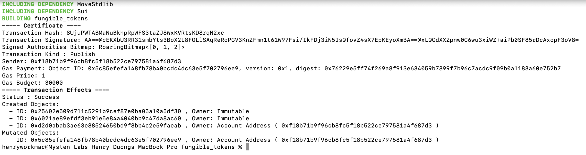
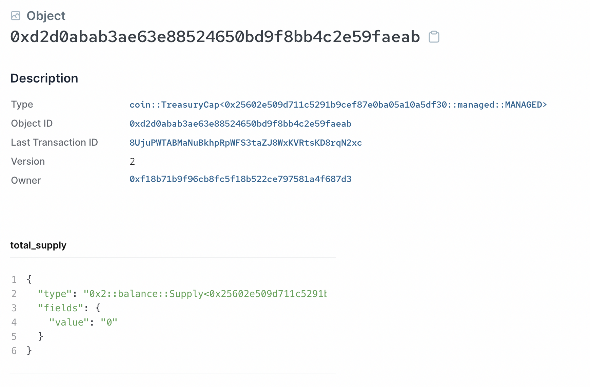
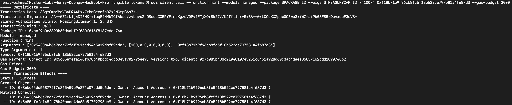
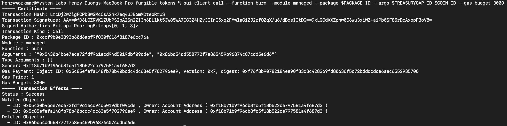

# Managed Coin 案例

我们已经深入了解了`sui::coin` 模块，现在我们可以来看一个简单但是完整的案例，即创造一种由可信任管理员 mint 和 burn 的自定义的同质化代币，与许多 ERC-20 代币实现相似。

## 智能合约

你可以在项目案例文件夹中找到完整的 [Managed Coin 案例合约](https://github.com/sui-foundation/sui-move-intro-course/blob/main/unit-three/example_projects/fungible_tokens/sources/managed.move)。

根据我们目前课程所涵盖的内容，这份合约应该很容易理解。它完全遵守 [One Time Witness](https://github.com/sui-foundation/sui-move-intro-course/blob/main/unit-three/lessons/3_witness_design_pattern.md#one-time-witness) 模式，`witness` 资源就叫 `MANAGED`，由 `init` 功能模块自动创建。

然后，`init` 功能通过调用 `coin::create_currency` 获取 `TreasuryCap` 和 `CoinMetadata` 资源，得到的参数就是 `CoinMetadata` 对象的字段，包括代币名称、符号、图标地址等。

通过 `transfer::freeze_object` 方法创建后，`CoinMetadata` 立刻就冻结了，之后就变成可以被任何地址读取的[不可变共享对象](https://github.com/RandyPen/sui-move-intro-course-zh/blob/main/unit-two/lessons/2_所有权.md)。

`TreasuryCap` [Capability object](https://github.com/RandyPen/sui-move-intro-course-zh/blob/main/unit-two/lessons/6_capability_设计模式.md) 被用作控制调用 `mint` 和 `burn` 方法的一种方式，`mint` 和 `burn` 分别可以铸造和燃烧 `Coin<MANAGED>` object。

## 发布和 CLI 测试

### 发布 Module

在 [fungible_tokens](https://github.com/sui-foundation/sui-move-intro-course/blob/main/unit-three/example_projects/fungible_tokens) 项目文件夹下，运行：

```bash
sui client publish --gas-budget 30000
```

你可以看到控制台输出类似下面的内容：



 创建的两个不可变对象分别是 package 本身和 Managed Coin 的 CoinMetadata object，交易发送人收到并拥有的对象就是 Managed Coin 的 TreasuryCap对象。



Export the object ID's of the package object and the `TreasuryCap` object to environmental variables:

分别输出 package 对象和 TreasuryCap对象的ID地址到环境变量：

```bash
export PACKAGE_ID=<package object ID from previous output>
export TREASURYCAP_ID=<treasury cap object ID from previous output>
```

### 铸造代币

要铸造一些 `MNG` 代币，我们可以使用如下 CLI 命令：

```bash
sui client call --function mint --module managed --package $PACKAGE_ID --args $TREASURYCAP_ID \"<amount to mint>\" <recipient address> --gas-budget 3000
```

*💡注意：Sui的二进制版本 0.21.0 中，**u64* *输入必须被转义成字符串，也就是上面 CLI 命令格式。这在以后的版本中可能会有所改变。*



输出新铸造的 `COIN<MANAGED>` 对象的 ID 地址给 bash 变量：

```bash
export COIN_ID=<coin object ID from previous output>
```

确认 `TreasuryCap<MANAGED>` 对象下 `Supply` 字段应该增加了所铸造的数量。

### Burning Tokens

要销毁一个现存的 `COIN<MANAGED>` 对象，我们使用如下 CLI 命令：

```bash
sui client call --function burn --module managed --package $PACKAGE_ID --args $TREASURYCAP_ID $COIN_ID --gas-budget 3000
```



确认 `TreasuryCap<MANAGED>` 对象下 `Supply` 字段应该变回 `0`。

*练习：fungible token需要的其他一些普遍使用的功能是什么？你现在已经非常了解 MOVE 编程，尝试去实现这些功能吧。*