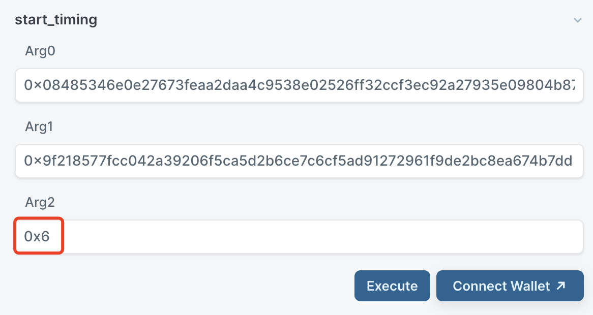

# 代币锁仓

[clock.move](https://github.com/MystenLabs/sui/blob/main/crates/sui-framework/packages/sui-framework/sources/clock.move)模块为智能合约提供了时间戳和计时的功能，我们可以用来实现代币锁仓，即项目方在合约发布足够长时间后才能解锁取回代币。

在本单元[第5小节 Managed Coin 案例](5_managed_coin.md) 的[代码](../example_projects/fungible_tokens/sources/managed.move)基础上修改实现。

## 锁仓代币仓库

### 构建代币仓库

定义一个代币仓库，用于存放代币。

```Rust
    use sui::balance::{Self, Balance};
    use sui::object::{Self, UID};

    struct ManageAdmin has key {
        id: UID
    }

    struct ManageStorage has key, store {
        id: UID,
        manage_balance: Balance<MANAGED>,
    }
```
其中，`ManageStorage`是存放代币的金库，`ManageAdmin`将作为操作金库的管理员权限。


在`init`函数内，分别声明存放于`ManageStorage`仓库中的代币数目。
```Rust
    fun init(witness: MANAGED, ctx: &mut TxContext) {
        // Get a treasury cap for the coin and give it to the transaction sender
        let (treasury_cap, metadata) = coin::create_currency<MANAGED>(witness, 2, b"MANAGED", b"MNG", b"", option::none(), ctx);
        // state the number of tokens held in the treasury
        transfer::share_object(
            ManageStorage {
                id: object::new(ctx),
                manage_balance: coin::mint_balance<MANAGED>(&mut treasury_cap, 1000000), 
            }
        );
        transfer::transfer(
            ManageAdmin {
                id: object::new(ctx),
            },
            tx_context::sender(ctx)
        );
        transfer::public_freeze_object(metadata);
        transfer::public_transfer(treasury_cap, tx_context::sender(ctx));
    }
```
其中，`ManageStorage`使用`share_object`实现，也可以采用其他方式实现。

### 取钱函数

定义一个需要`ManageAdmin`权限就可以将`ManageStorage`中的代币全部取走的函数。

```Rust
    // ---Admin Only---
    public entry fun withdraw_all(storage: &mut ManageStorage, _: &ManageAdmin, ctx: &mut TxContext) {
        let return_coin: Coin<MANAGED> = coin::from_balance(balance::withdraw_all(&mut storage.manage_balance), ctx);
        transfer::public_transfer(return_coin, tx_context::sender(ctx));
    }
```

至此，代币仓库以及可取回代币的功能已经实现。

## 添加时间约束

### 链上获取时间

Sui Network 上获取时间信息的方式有两种：
1. clock模块，可以提供近乎实时的时间戳，只有数秒时间差。但需要用到共享的Clock object, 需要时间达成共识，如果原本交易没有使用共享object，会因此增加交易所需时间；
2. epoch timestamps, 可以使用`sui::tx_context::epoch_timestamp_ms(ctx: &TxContext)`获取当前epoch起始时刻的时间戳，大约每24小时更新一次，时间没那么及时，但只用了`&TxContext`会比较方便。

### 初始化clock

下面使用clock模块实现锁仓的功能。  
引入clock模块，并以毫秒为单位定义时间。定义常量与错误码。

```Rust
    use sui::clock::{Self, Clock};

    // one day in millisecond
    const DAY_IN_MS: u64 = 86_400_000;

    // Errors
    const ENotStart: u64 = 0;
    const EStillClose: u64 = 1;
```

由于`init`函数只接受`witness`和`TxContext`参数，不接受`Clock`参数，因此计时启动需要在别的函数实现。

在`ManageStorage`中添加计时属性`start`. 新定义一个表示启动计时能力的`TimeCap`.

```Rust
    struct ManageStorage has key, store {
        id: UID,
        manage_balance: Balance<MANAGED>,
        start: u64,
    }

    struct TimeCap has key {
        id: UID,
    }
```

修改原有`init`函数，将`ManageStorage.start`设为`0`表示未开启计时⌛️。

```Rust
        transfer::share_object(
            ManageStorage {
                id: object::new(ctx),
                manage_balance: coin::mint_balance<MANAGED>(&mut treasury_cap, 1000000),
                start: 0,
            }
        );
        transfer::transfer(
            TimeCap {
                id: object::new(ctx),
            },
            tx_context::sender(ctx)
        );
```

### 启动计时

添加启动计时的`entry`函数，调用`clock::timestamp_ms`将`ManageStorage.start`设为当前时间。并且销毁`TimeCap`, 限制该启动计时函数只能被运行一次。

```Rust
    public entry fun start_timing(storage: &mut ManageStorage, time_cap: TimeCap, clock_object: &Clock) {
        storage.start = clock::timestamp_ms(clock_object);
        let TimeCap { id } = time_cap;
        object::delete(id);
    }
```


### 计时约束

修改`withdraw_all`函数，添加时间约束。

```Rust
    public entry fun withdraw_all(storage: &mut ManageStorage, _: &ManageAdmin, clock_object: &Clock, ctx: &mut TxContext) {
        assert!(storage.start > 0, ENotStart);
        assert!(clock::timestamp_ms(clock_object) >= storage.start + DAY_IN_MS * 365 * 3, EStillClose);
        let return_coin: Coin<MANAGED> = coin::from_balance(balance::withdraw_all(&mut storage.manage_balance), ctx);
        transfer::public_transfer(return_coin, tx_context::sender(ctx));
    }
```

结合Clock模块的锁仓功能实现完毕，[完整的代码可以在这里找到](../example_projects/lockup/sources/lockup.move)。

### 发布和 CLI 测试

在合约发布之后，需要先执行`start_timing`, 满足时长之后才能调用`withdraw_all`函数。测试时可以将时间数值改小一点，便于部署测试。

在调用`start_timing`函数时，第三个参数输入`0x6`，表示共享的Clock模块。该Clock模块在创世区块中创建，开始计时，不可被更改。


其他输入参数有`&Clock`的，也用同样方式调用。

### 编程练习

除了最基本的实现案例，您在学习过程中可以尝试添加如下功能进行练习：
- 改为流支付形式的锁仓
- 改`share object`为`object_wrapping`实现
- 改为使用`epoch timestamps`获取时间信息
- 分批次解锁，比如一年、两年、三年分批解锁

