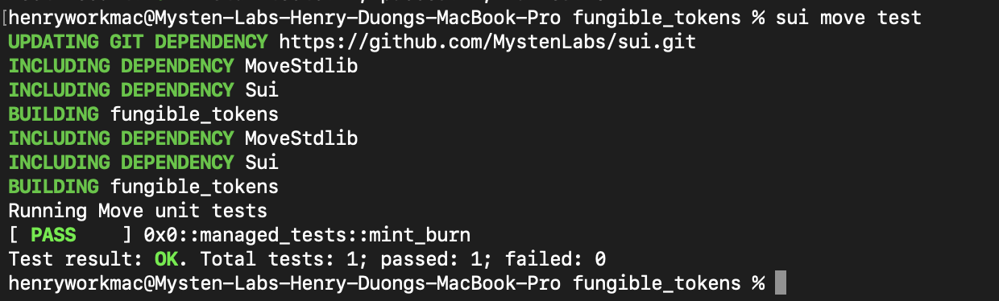

# 单元测试

Sui 支持 [Move Testing Framework](https://github.com/move-language/move/blob/main/language/documentation/book/src/unit-testing.md)。这里我们将为 `Managed Coin` 创建一些单元测试，来展示怎样写和运行单元测试。

## 测试环境

Sui Move 测试代码与其他任何 Sui Move 代码没有什么不同，但是它有一些特别的注释和功能来区分真实产品环境和测试环境。

首先，你可以在测试功能或模块最顶部使用 `#[test]` 或 `#[test_only]` 注释来标记测试环境。

```rust
#[test_only]
module fungible_tokens::managed_tests {
  #[test]
  fun mint_burn() {
  }
}
```

我们会将 `Managed Coin` 的单元测试放入到单独的测试模块，叫做 `managed_tests`。

模块中的每一个功能可以看作是一个单元测试，每个单元测试是由一个或多个交易组成。我们这里只写一个叫做 `mint_burn` 的单元测试。

## Test Scenario

在测试环境中，我们将主要利用 [test_scenario](https://github.com/MystenLabs/sui/blob/main/crates/sui-framework/sources/test/test_scenario.move) 包来模拟一个运行环境。这里我们需要理解和交互的主要对象是 Scenario object。一个 Scenario 模拟一个多重交易事件，并且可以用发送人地址将其初始化，如下所示：

```rust
  // Initialize a mock sender address
  let addr1 = @0xA;
  // Begins a multi transaction scenario with addr1 as the sender
  let scenario = test_scenario::begin(addr1);
  ...
  // Cleans up the scenario object
  test_scenario::end(scenario);  
```

*💡注意* *Scenario* *object 不可删除，所以必须在末尾使用* *test_scenario::end* *明确对其进行清理。*

### Initializing the Module State

为了测试我们的 Managed Coin模块，我们需要初始化模块状态。考虑到模块具有`init`功能，我们首先需要在 managed模块中创造一个 test_only init 功能：

```rust
#[test_only]
    /// Wrapper of module initializer for testing
    public fun test_init(ctx: &mut TxContext) {
        init(MANAGED {}, ctx)
    }
```

这本质上就是一个模拟的`init`功能，只用于测试。接下来我们可以在测试场景中调用这个功能初始化运行状态：

```rust
    // Run the managed coin module init function
    {
        managed::test_init(ctx(&mut scenario))
    };
```

### Minting 

在铸造 `Coin<MANAGED>` 对象场景中，我们使用 [next_tx](<https://github.com/MystenLabs/sui/blob/main/crates/sui-framework/sources/test/test_scenario.move>) 方法前进到下一个交易。

为了完成铸造，我们首先需要提取 `TreasuryCap<MANAGED>` 对象。我们使用一个叫做 `take_from_sender` 的特别测试功能在我们的场景中检索 `TreasuryCap<MANAGED>` 对象。注意我们需要将我们尝试检索对象的类型参数传递给 `take_from_sender` 。

然后我们直接调用 `managed::mint` ，用上所有所需的参数。

在交易的最后，我们必须使用 `test_scenario::return_to_address` 将 `TreasuryCap<MANAGED>` 对象返回到发送人地址。

```rust
next_tx(&mut scenario, addr1);
{
  let treasurycap = test_scenario::take_from_sender<TreasuryCap<MANAGED>>(&scenario);
  managed::mint(&mut treasurycap, 100, addr1, test_scenario::ctx(&mut scenario));
  test_scenario::return_to_address<TreasuryCap<MANAGED>>(addr1, treasurycap);
};
```

### Burning 

测试燃烧代币基本跟测试铸造代币完全一样，除了我们也需要在代币持有者那检索 `Coin<MANAGED>`对象。

## Running Unit Tests

完整的 [managed_tests](<https://github.com/sui-foundation/sui-move-intro-course/blob/main/unit-three/example_projects/fungible_tokens/sources/managed_tests.move>) 模块源代码位于 `example_projects` 文件夹中。

要运行单元测试，我们只需要在项目目录的 CLI 中输入如下命令：

```bash
sui move test
```

你就可以看到控制台的输出结果显示哪个单元测试通过了，哪个没通过。



