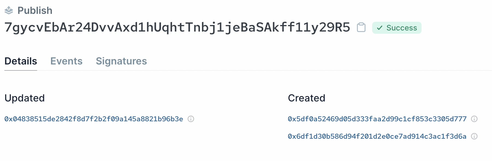
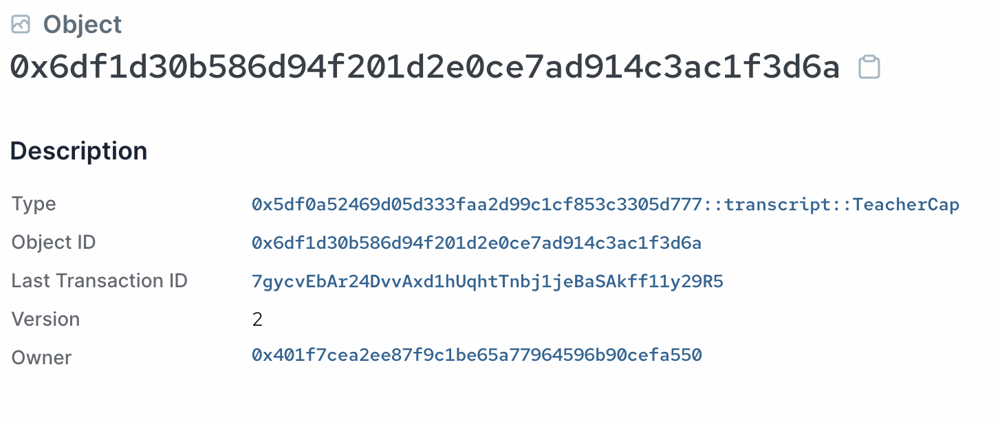

# Capability 设计模式

现在我们已经有了一个基础的成绩记录单发布系统，还可以给我们的智能合约添加获取权限。

在 Sui 这种以 object 为中心的模型中，Capability 是一种常用的调整获取权限的设计模式。看一下我们该如何定义 capability object:

```rust
    // Type that marks the capability to create, update, and delete transcripts
    struct TeacherCap has key {
        id: UID
    }
```

我们可以通过定义一个新的 `TeacherCap` struct 来标记能够对成绩记录单实现特许操作的 capability 能力。如果想让这种 capability 是不可被转移的，只需要简单地在定义这个 struct 时不加上 `storage` 的能力即可。

*💡注意: 这种方法也同样适用于在 Move 里头实现 soulbound tokens (SBT). 只需要简单地定义一个具有 `key` 能力但没有 `store` 能力的 struct 即可。*

## 传递和消耗 Capability Objects

接下来，我们要修改这个函数方法使其只能被拥有 `TeacherCap` capability object 的人调用。修改后的函数会将 capability 作为额外的参数传入，并且立即消耗它。

比如说，对这个 `create_wrappable_transcript_object` 函数方法，我们可以做出下面的修改: 

```rust
    public entry fun create_wrappable_transcript_object(_: &TeacherCap, history: u8, math: u8, literature: u8, ctx: &mut TxContext) {
        let wrappableTranscript = WrappableTranscript {
            id: object::new(ctx),
            history,
            math,
            literature,
        };
        transfer::transfer(wrappableTranscript, tx_context::sender(ctx))
    }
```

我们传入了一个 `TeacherCap` capability object 的引用，然后使用 `_` 将其标注为未使用的变量或参数消耗掉。因为我们只传进了该 object 的引用，消耗掉这个引用对原始的 object 不造成任何影响。

*问题: 如果尝试将 `TeacherCap` 的值传入会发生什么呢?*

这个改动使得只有一个拥有了唯一 `TeacherCap` object 的地址能够调用该函数方法，对该函数方法实现了获取权限控制。

我们对合约中的其他函数方法进行相似的改动，对成绩记录单实现专有操作。

## 初始化函数

Module 的初始化函数会在发布之后被立即调用。这可以用来初始化智能合约的初始状态，通常被用来分发最初的 capability objects.

在我们的例子中，可以像下面那样定义 `init` 初始化函数:

```rust
    /// Module initializer is called only once on module publish.
    fun init(ctx: &mut TxContext) {
        transfer::transfer(TeacherCap {
            id: object::new(ctx)
        }, tx_context::sender(ctx))
    }
```

这会在 module 刚完成发布后创建一份 `TeacherCap` object 的拷贝，并且将其发送给发布合约者的地址。

下面是使用[Sui Explorer](../../unit-one/lessons/6_hello_world.md#viewing-the-object-with-sui-explorer)看到的发布合约交易产生的效果:



其中在上面交易中创建的第二个 object 是 `TeacherCap` object 的实例，会被发送到发布者的地址:



*问题: 那么第一个被创建的 object 是什么?*

## 添加更多教师或管理员

要向更多地址提供管理权限，我们可以像下面那样定义函数去创建和分发更多 `TeacherCap` objects:

```rust
    public entry fun add_additional_teacher(_: &TeacherCap, new_teacher_address: address, ctx: &mut TxContext){
        transfer::transfer(
            TeacherCap {
                id: object::new(ctx)
            },
        new_teacher_address
        )
    }
```

这个函数是复用 `TeacherCap` 来管理权限，但如果有需要，你也可以定义一个新的 capability struct 来定义超级管理员权限。

**这里能找到对应这里的第三版处于开发进展中版本的代码: [WIP transcript.move](../example_projects/transcript/sources/transcript_3.move_wip)**
