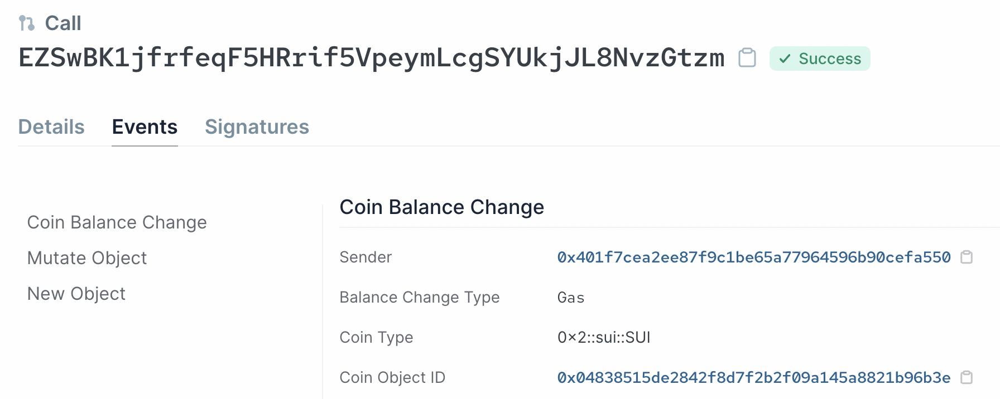
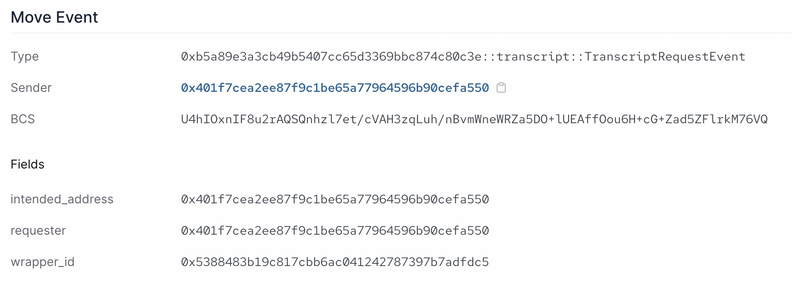

# Events

Events 对 Sui Move 智能合约很重要，是索引器 indexers 追踪链上行为时的主要方法。对比服务器后端，你可以将 events 理解为服务器日志 logging, 而 indexers 则是解析器 parsers. 

Sui 上面的 events 也是以 objects 的形式表示。在 Sui 中有几种系统层级的 events, 包括 Move event, Publish event, Transfer object event 等。要看系统层级 event 类型的完整清单，可以参考这份 [Sui Events API 页面](https://docs.sui.io/build/event_api)。

交易产生的 event 详情可以在 [Sui Explorer](https://explorer.sui.io/) 下面的 `Events` 标签页查看:



## 定制化 Events

开发者也可以在 Sui 上根据需要自己定义 events. 可以像下面那样定制一个 event 来标记一次请求成绩记录单的事件。

```rust
    /// Event marking when a transcript has been requested
    public struct TranscriptRequestEvent has copy, drop {
        // The Object ID of the transcript wrapper
        wrapper_id: ID,
        // The requester of the transcript
        requester: address,
        // The intended address of the transcript
        intended_address: address,
    }
```

表示 event 的类型具有 `copy` 和 `drop` 的能力。Event objects 不代表资产，我们只对其包含的数据感兴趣。所以，它们可以被复制，在作用域结束后被销毁。

要在 Sui 上发出一个 event 信号，你只需要使用[`sui::event::emit` 函数方法](https://github.com/MystenLabs/sui/blob/main/crates/sui-framework/docs/event.md#function-emit)。

调整一下我们的 `request_transcript` 函数方法去发出这一 event 信号:

```rust
    public entry fun request_transcript(transcript: WrappableTranscript, intended_address: address, ctx: &mut TxContext){
        let folderObject = Folder {
            id: object::new(ctx),
            transcript,
            intended_address
        };
        event::emit(TranscriptRequestEvent {
            wrapper_id: object::uid_to_inner(&folderObject.id),
            requester: tx_context::sender(ctx),
            intended_address,
        });
        //We transfer the wrapped transcript object directly to the intended address
        transfer::transfer(folderObject, intended_address);
    }
```

在 Sui explorer 中，我们可以看到发出 event 的信息会像下面那样陈列。我们在 `TranscriptRequestEvent` event 中定义的三条数据属性都被展示了出来:



**这里能找到这个成绩记录单示例项目的完整代码: [transcript.move](../example_projects/transcript/sources/transcript.move)**

尝试使用 Sui CLI 客户端去创建，请求和解包成绩记录单，然后用 Sui explorer 去检验结果。

第二单元到这里结束。如果你完整跟到这里，干得不错！